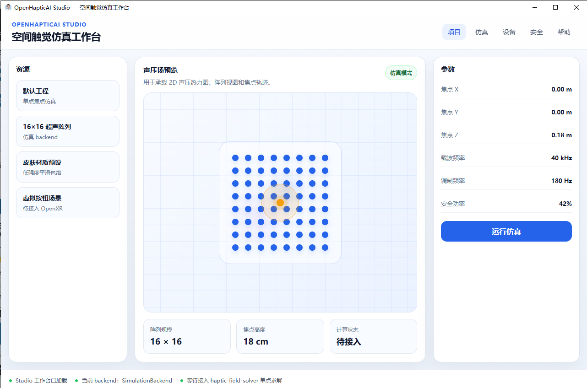

# OpenHapticAI

> BRAIN AI 旗下 · AI-native 空中触觉交互框架 · 早期研究预览

**OpenHapticAI** 由深圳兆小白人工智能发起，探索 AI 时代空间触觉交互的可能性。

今天的 AI 已经能看、能听、能推理——但还不能**触摸**。  
OpenHapticAI 的方向是：让数字世界中的 AI、虚拟对象和空间场景，具备真实可感知的空中触觉反馈。

---

## OpenHapticAI Studio

**OpenHapticAI Studio** 是本项目的核心桌面工作台，运行于本地，用于声场仿真、触觉参数调试与 AI 触觉意图验证。

当前处于**早期研究预览阶段**，功能持续迭代中。

---

## 关于本仓库

本仓库为公开的原创框架骨架与参考实现，遵循以下原则：

- 不包含第三方项目源码拷贝
- 核心算法参数、商业校准数据、私有触觉数据集**不在公开仓库中**
- 如引入第三方代码或硬件设计，将保留完整 attribution 和许可证声明

---

## 许可证

`AGPL-3.0-or-later`

---

## 作者

**吴龙** — 深圳兆小白人工智能  
GitHub: [heweijie1](https://github.com/heweijie1)
